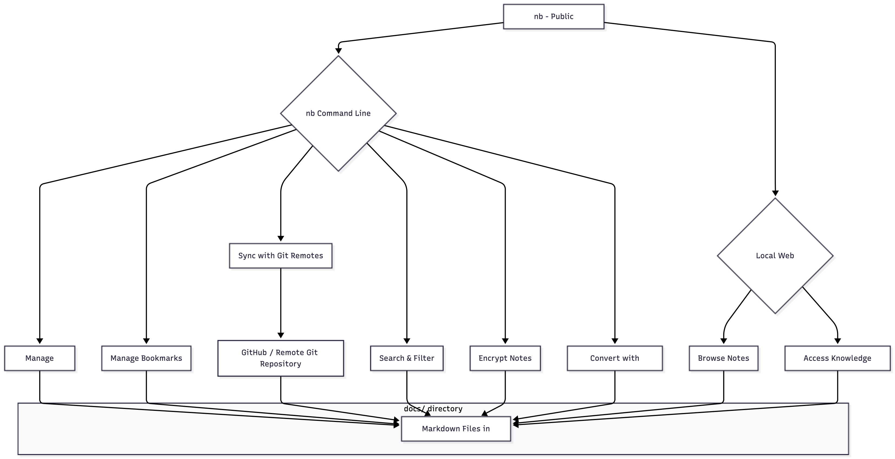

# README

## リポジトリ概要

このリポジトリは、「nb」というコマンドラインツールとローカルウェブアプリケーションによって管理される公開ノートブックです。Markdown形式のノート、ブックマーク、アーカイブ、知識ベースを一元的に管理し、GitHubなどのリモートリポジトリと同期することで、複数のデバイス間での共有・同期を容易にします。

### 主要機能

-   **ノート管理**: Markdown形式でのノートの作成、編集、削除、表示、リスト化。
-   **Git連携**: Gitによるバージョン管理を自動的に行い、リモートリポジトリとの同期を通じてコンテンツの共有とバックアップを実現します。
-   **ブックマーク機能**: ウェブページのURLを保存し、管理します。
-   **検索・フィルタリング**: ノートやブックマークをキーワード、タグ、日付などで効率的に検索・絞り込み、様々な条件でソートできます。
-   **Wikiスタイルのリンク**: ノート間で簡単に参照できる `[[リンク名]]` 形式の内部リンクをサポートします。
-   **暗号化**: 機密性の高いノートをパスフレーズで暗号化し、保護します。
-   **変換機能 (Pandoc連携)**: ノートをPDF、HTML、Word (docx)、EPUBなど、多様な形式にエクスポートできます。
-   **インポート/エクスポート**: ファイル、ディレクトリ、URL、標準入力からのノートのインポート、および各種形式でのエクスポートが可能です。
-   **アーカイブ**: 古いノートや使用頻度の低いノートをアーカイブして整理します。
-   **プラグインと拡張性**: 機能拡張のためのプラグインシステムをサポートし、カスタムスクリプトも利用可能です。

---

### 概要図

---

**このリポジトリをテンプレートとして導入し、自分用に「追記」していくという手法はいかがでしょう**

**（注）パブリック・リポジトリでこのまま使用すると「公開ノート」となりますのでご留意ください**

---

- ライセンス

  MIT License

- 使用ツール

  nb  /  [公式サイト]（https://xwmx.github.io/nb/）

- 貢献

  プルリクエストやイシューの報告を歓迎?します！

- 更新履歴

　　v0.1.1

---

*初回発行: 2025年11月1日*
*最終更新: 2025年11月7日*

---
