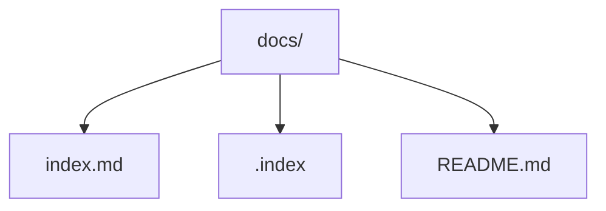

---

title: nb - Public
---

# nb - Public

## 🚧 **工事中**

公開ノートブックへようこそ！ このページは現在構築中です。

### クイックリンク
- [ホーム](index.md)
- [ルートに戻る](../README.md)

---

## nbコマンドでコンテンツをプッシュする

`nb`コマンドを使ってこのノートブックからリモートリポジトリにコンテンツをプッシュするには、以下の手順に従ってください：

1. **リモートリポジトリを設定する**: ノートブックのリモートURLを設定します。
   ```
   nb remote set https://github.com/yourusername/your-repo.git
   ```

2. **変更をプッシュする**: ローカルノートブックをリモートリポジトリと同期し、新しいまたは更新されたコンテンツをプッシュします。
   ```
   nb sync
   ```

   - このコマンドは自動的に変更をコミットし、リモートにプッシュします。
   - 複数のノートブックがある場合、ノートブックを指定してください: `nb example:sync`

Git同期とリモート管理の詳細については、[nbドキュメント](https://xwmx.github.io/nb/#-git-sync)を参照してください。

---

## ファイル構造



---

*最終更新: 2025年11月*