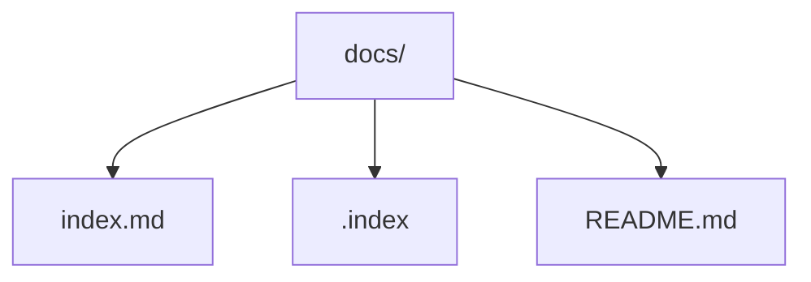

# nb - Public - INDEX

## PKMツールとしての"nb"

Notion,Obsidian,Joplin ... どれも優れたツールです。
それらの登場によって日陰者になった感のあるツールが "nb" です。
しかしながら日常的にターミナルを使う人ならば事情が違います。
案外 ”nb” は使い勝手が良かったりします。
AIが生成する大量のテキストを「整理」を気にせずにただ貯めておけるからです。
もちろん取り出しも容易です。
ちょっと触ってちょっと慣れたら、"nb"が好きになるかもしれませんよ。
ということで、このリポジトリを備忘を兼ねて公開することにしました。
どうかお試しください。


### 公開ノートブック（テンプレート）です。


## クイックリンク
- [ホーム](index.md)
=======
### クイックリンク
- [ホーム:INDEX](index.md)
- [使い方](usage.md)
- [虎の巻](assist.md)

---

## nbでコンテンツ（xxx.md）を作成します。

`nb`コマンドでモートリポジトリにコンテンツをプッシュするには以下の手順に従ってください：

1. **リモートリポジトリを設定する**: ノートブックのリモートURLを設定します。
   ```
   nb remote set https://github.com/yourusername/your-repo
   ```

2. **変更をプッシュする**: ローカルノートブックをリモートリポジトリと同期し、新しいまたは更新されたコンテンツをプッシュします。
   ```
   nb sync --remote origin
   ```

   - このコマンドは自動的に変更をコミットし、リモートにプッシュします。
   - 複数のノートブックがある場合、ノートブックを指定してください: `nb example:sync`

Git同期とリモート管理の詳細については、[nbドキュメント](https://xwmx.github.io/nb/#-git-sync)を参照してください。

参考：

## ファイルの配置

```PlainText
.nb-public
├── README.md
└── docs
    └── index.md（このファイル）
    └── xxx.md（このファイルからのリンク先）
    └── yyy.md（このファイルからのリンク先）
    └── zzz.md（このファイルからのリンク先）
```

> docs/内が web となります
> nb-pulic直下に、.md（ファイルを）を保存してください。
> GitHubのリポジトリにプッシュ（`nb sync --remote origin`）すると、非常に簡単にweb公開できます。
> *GitHub Pagesについては、[公式ドキュメント]（https://docs.github.com/ja/pages）を参照してください*


参考：



---

*初回発行: 2025年11月1日*
*最終更新: 2025年11月7日*

---
